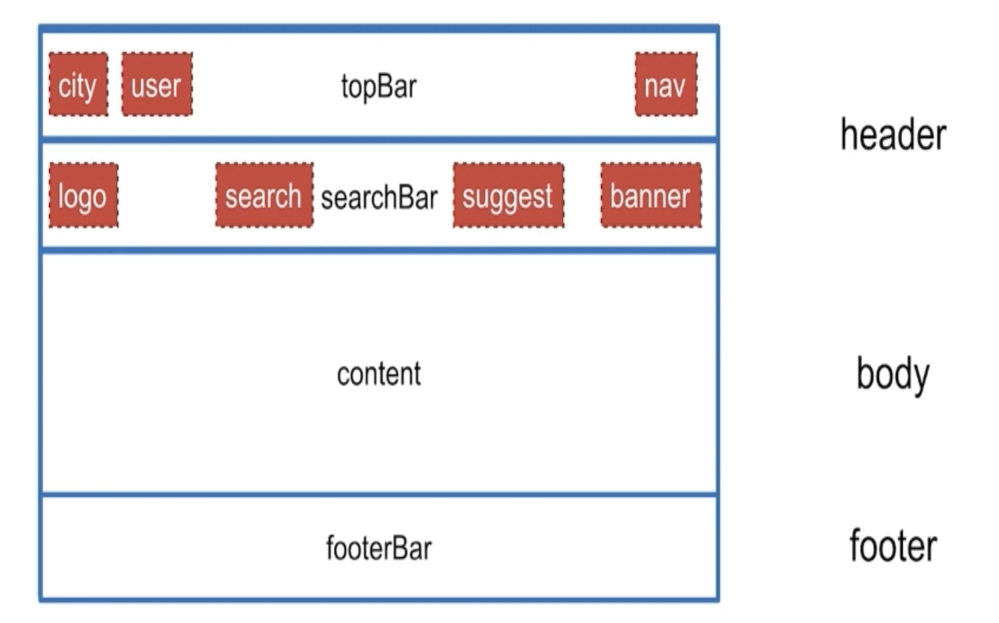

# E-commerce

一个涵盖了Vue技术栈、Nuxt.js、Koa2、Mongodb、Redis等众多前后端技术并结合element-ui的电商项目。

## 项目简介
**主要功能：**

- 登录注册
- SMTP服务（邮箱验证）
- 组件复用设计、接口设计
- 搜索、推荐服务
- 城市、定位、地图服务
- 服务端缓存
- 后台管理

**技术内容：**

- Vue 2.5语法
- [Vue CLI3](https://cli.vuejs.org/zh/)脚手架
- Vuex实现数据和状态的同步
- Nuxt.js和Koa2实现SSR
- redis服务端缓存
- Mongoose来管理Mongodb数据库

## 项目开发

### 环境准备

node v10.14.0

Vue 2.5.21

npm v6.5.0

webpack v4.28.3

Nuxt v2.3.4

### 项目安装

1. `npm install -g npx`
2. `npx creat-nuxt-app E-commerce`

### 辅助工具安装

- 安装mongodb数据库 [文档](https://mongoose.shujuwajue.com/guide/models.html)
- 安装Robo 3T [Download](https://robomongo.org/download)

### 开始项目

1.  `npm i -g @vue/cli`
2. `vue creat E-commerce`
3. `cd E-commerce `
4. `npm run serve`

### 首页功能

#### 需求分析

**1. 模板设计**



[Element ui 容器布局](http://element-cn.eleme.io/#/zh-CN/component/container)

**2. 组件设计** 

- 城市服务组件
- 用户数据和状态

**3. 数据结构设计**
mongodb命令行导入数据：

`mongoimport -d ecommerce(数据库) -c areas(数据表) areas.dat(数据源)`

**4. 接口设计**

**城市服务类接口Geo**

> /geo/getPosition		根据ip定位当前城市
>
> /geo/province		获取所有省份
>
> /geo/province/:id		获取指定id的省份
>
> /geo/city			获取所城市
>
> /geo/hotCity			获取热门城市数据
>
> /geo/menu			获取菜单项数据

**查询类接口Search**

> /search/top					搜索框查询结果数据
>
> /search/resultsByKeywords	根据关键词检索相关列表
>
> /search/hotPlace				热门搜索数据
>
> /search/products				产品列表数据
>
> /search/product/:id			根据产品的id获取详情数据

### 登录注册

### Search搜索

### 切换城市页

### 产品列表页

**高德地图组件**

- [高德开放平台](https://lbs.amap.com/api/javascript-api/guide/abc/prepare)

## 项目总结和感想

## Build Setup

```bash
# install dependencies
$ yarn install

# serve with hot reload at localhost:3000
$ yarn run dev

# build for production and launch server
$ yarn run build
$ yarn start

# generate static project
$ yarn run generate
```

For detailed explanation on how things work, checkout [Nuxt.js docs](https://nuxtjs.org).